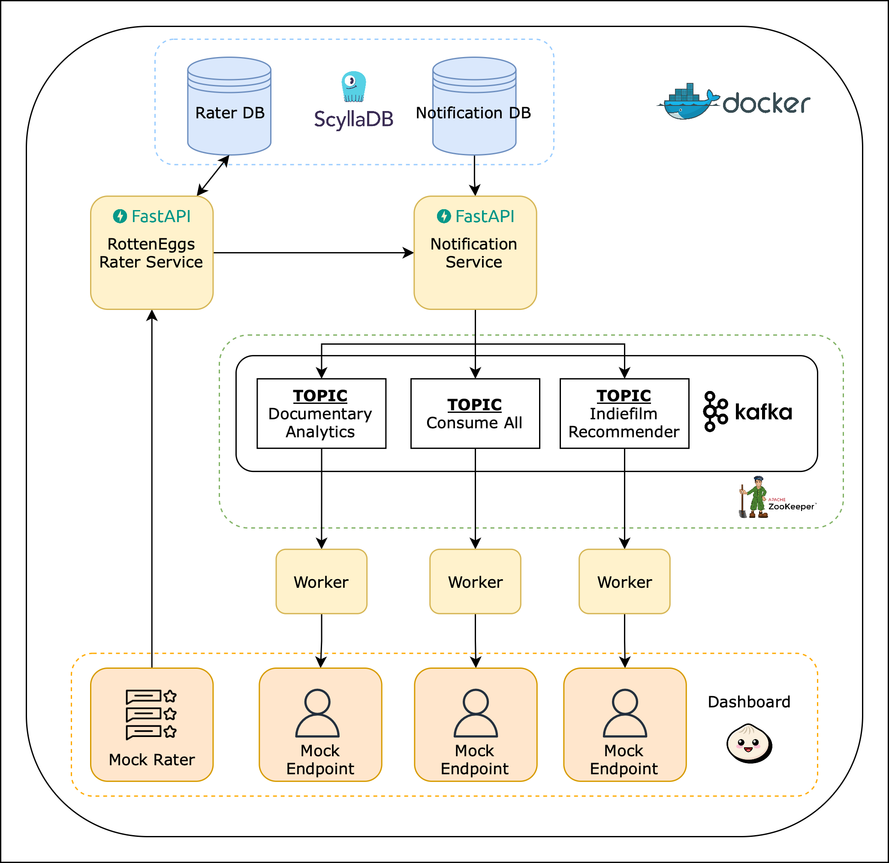

# Rotten Eggs

An exploration of notification services.
Inspired by [bookmarks](https://bookmarks.reviews), kind of.

## Prerequisites
Versions used at the time of implementation:

* Docker version 27.4.0
* Docker Compose version v2.31.0-desktop.2
* Python 3.12.0

## Architecture


## Setup
1. Download the tmdb_5000_credits.csv file from [here](https://www.kaggle.com/datasets/tmdb/tmdb-movie-metadata) and copy it into a subfolder `data/`.
1. To setup pre-commit, run:
    ```shell
    pre-commit install
    ```
1. Generate the files needed to populate the database intially:
    ```shell
    python3 scripts/raw_movie_parser.py
    ```
1. Start the docker containers:
    ```shell
    docker compose up --build -d
    ```
1. Head to http://localhost:3000 to view the dashboard.
